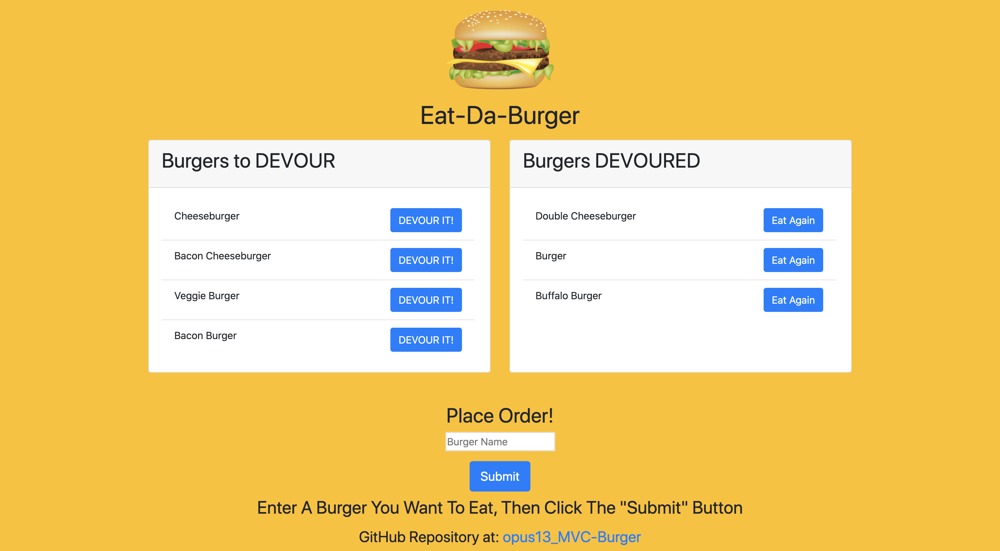

# opus13_MVC-Burger

  

## Description

This is a restaurant application that allows a user input a burger that they would like to eat, change its' status from uneaten to eaten and back as well. These burgers are stored in a database. It uses the Model View Controller (MVC) methodology using MySQL, Handlebars, Bootstrap and Node.js.

## Table of Content

* [Installation](#installation)

* [Repository](#repository)

* [Deployment](#deployment)

* [Usage](#usage)

* [License](#license)

* [Contributing](#contributing)

* [Tests](#tests)

* [Questions](#questions)

## Installation

There is no need to install anything at this time. This is an online application.

## Repository

This project's repository is at: [opus13_MVC-Burger](https://github.com/AJFree458/opus13_MVC-Burger)

## Deployment

This application is currently deployed through [Heroku](https://ancient-woodland-06582.herokuapp.com/).

## Usage

To use this application, go to the deployed web page. Under the "Place Order" there is an input field. Use that to add a burger. After the user has entered the burger they want, click on the "Submit" button to add to the "Burgers to DEVOUR" area. Each burger in this area has a button that says "DEVOUR IT!". Clicking it will update the burger, and change its' position to the "Burgers DEVOURED" area. The burgers in this field each have a button that says "Eat Again". Clicking it will change the burger back first card.

## License

This project is under the MIT license.

## Contributing

Please report issues and concerns. Fork the repo if desired, and do requests.

## Credit

Main Contributor: Arthur Freeman

## Tests

At this time, there are no tests to be run.

## Questions

If you have any questions about the repo, open an issue or contact [AJFree458](https://api.github.com/users/AJFree458) directly at rthr.frmn@gmail.com.